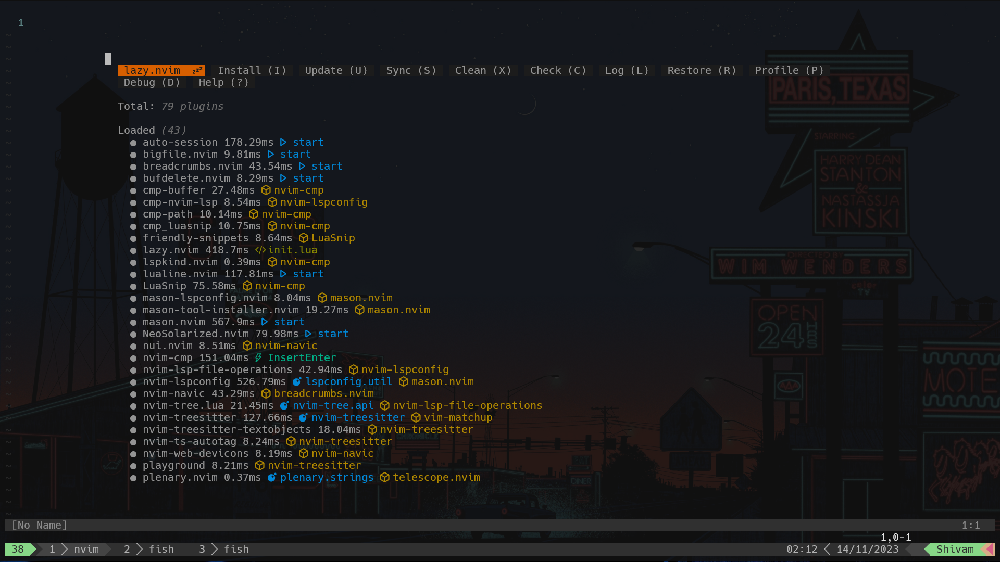
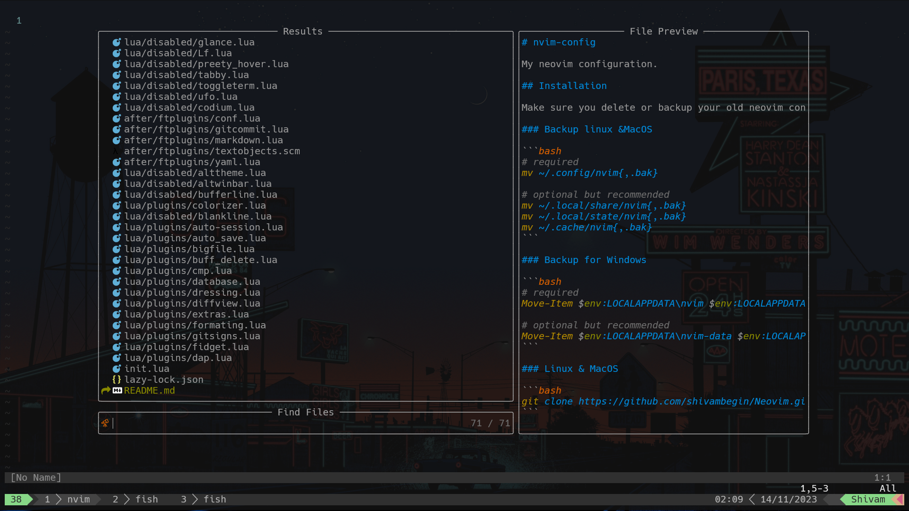
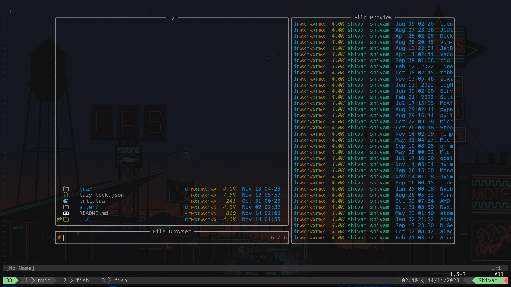
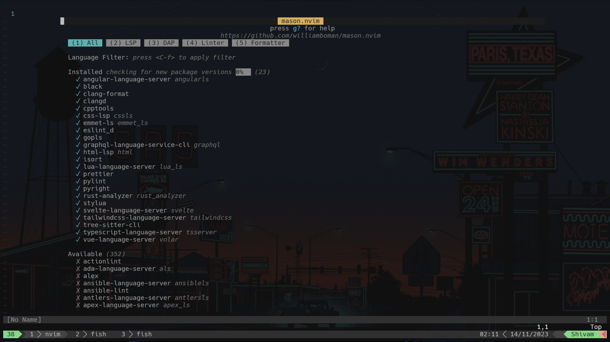

# nvim-config

My neovim configuration.

## Installation

Make sure you delete or backup your old neovim configuration to somewhere safe before installing this one.

### Backup linux &MacOS

```bash
# required
mv ~/.config/nvim{,.bak}

# optional but recommended
mv ~/.local/share/nvim{,.bak}
mv ~/.local/state/nvim{,.bak}
mv ~/.cache/nvim{,.bak}
```

### Backup for Windows

```bash
# required
Move-Item $env:LOCALAPPDATA\nvim $env:LOCALAPPDATA\nvim.bak

# optional but recommended
Move-Item $env:LOCALAPPDATA\nvim-data $env:LOCALAPPDATA\nvim-data.bak
```

### Linux & MacOS

```bash
git clone https://github.com/shivambegin/Neovim.git ~/.config/nvim
```

### Windows

```bash
git clone https://github.com/shivambegin/Neovim.git $env:LOCALAPPDATA\nvim
```
# Overview

## plugin manager(Lazy)



## file browsing with telescope



## file browsing with file browser



## file browsing with nvim-tree


## lsp manager mason




## Setup

- **Terminal:** windows terminal + tmux
- **Shell:** fish + starship
- **Editor:** nvim
- **Source control:** git
- **Theme:** neosolarized

## Neovim

- **Plugin manager:** lazy
- **Statue line:** lualine
- **Completions:** nvim-cmp
- **LSP:** mason, none-ls,
- **Syntax highlighting:** treesitter
- **Fuzzy finder:** telescope
- **File tree:** nvim-tree
- **Snippets:** LuaSnip
- Other goodies...

---

Author : Shivam Rajput

Email: shivamrajputcse@gmail.com
